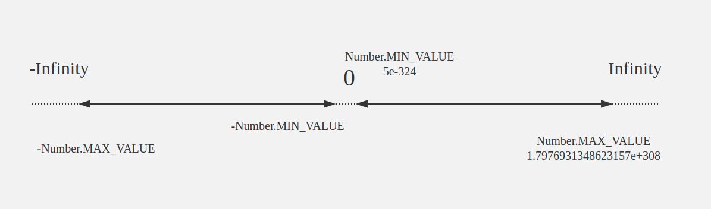
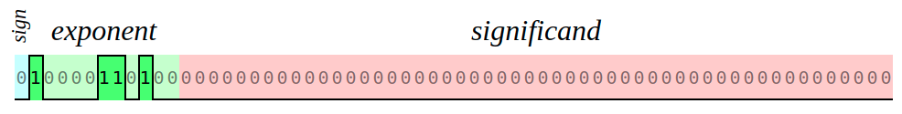

### 问题引出：在Javascript里，0.1 + 0.2 === 0.3？###

在控制台里面执行一下`0.1 + 0.2 // 0.30000000000000004`。
显然`0.1 + 0.2 !== 0.3`

### 深入探索 ###

Javascript使用IEEE754标准的双精度浮点数二进制存储，8个字节共64位表示一个数字。

[IEEE754标准，百度百科](https://baike.baidu.com/item/IEEE%20754/3869922)
[IEEE754标准，wiki百科](https://zh.wikipedia.org/wiki/IEEE_754)

采用小端模式，其中第63位表示符号位，第52-62位共11位表示指数位，0-51位共52位代表小数位。

我们知道3bit可以表示2^3 = 8个二进制数 `[ 000, 001, 010, 011, 100, 101, 110, 111 ]`。
11bit最多表示2^11 = 2048个二进制数，排除`00000000000`和`11111111111`这两种情况，还剩下2046个二进制数。所以如果中间值（即偏移量）为`(2^11 - 2^1) / 2 = 1023`。指数位减掉偏移量，就可以表示`1023 ~ -1022`这个范围。

小数位M是一个`[1, 2)`范围内的浮点数（几种特殊情况除外），所以第一位可以省略。

>这里有三个特殊值需要指出，详细见标准：

>如果指数是0并且尾数的小数部分是0，这个数±0（和符号位相关）

>如果指数= 2^11 - 1 并且尾数的小数部分是0，这个数是±∞（同样和符号位相关）

>如果指数= 2^11 - 1 并且尾数的小数部分非0，这个数表示为不是一个数（NaN）。

那么javascript中可以表示的最大的数字即为满足以下条件的值:

1、指数位满足减掉偏移量1023后为`1023`，二进制表示的`2046`，即`11111111110`。

2、小数位全是1，代表每一位都是存在。

3、符号位0、1都可，分别代表正负两个方向。

### 最大值为多少？ ###

最大值为`2^1023 * (1 * 2^0 + 1 * 2^-1 + ... + 1 * 2^-52)`

提出`2^-52`得到`2^1023 * 2^-52 * (2^52 + ... + 2^0)`

得到`2^971 * (2^53 - 1)`，这个值就是javascript能表示的最大数字`1.7976931348623157e+308`


### 引申，最小值是多少？ ###

如果指数是0并且尾数的小数部分不是0

根据上述可知最小值为`2^-1022 * (0 * 2^0 + 0 * 2^-1 + ... + 1 * 2^-52)`

得到`2^-1074`，这个值就是javascript能表示的最小数字`5e-324`

### 稍微总结一下 ###



相同的位数所能表示的数字的精度和范围是一对不合调和的矛盾，必须在这两者之间做取舍。
同样64位8字节，如果想扩大计数范围，可以将指数位适当扩大，减少小数位的位数。如果想得到高精度的数，就可以提高小数位的位数，减少指数位。

那么根据双精度格式，我们推导下单精度格式表示的数字范围。

单精度浮点数占用4个字节，共32比特。包括1位符号位，8位指数位，23位小数位。

那么单精度指数偏移值为`(2^8 - 2) / 2`，是`127`。
那么最大值就是`2^104 * (2^24 - 1)`，是`3.402823e38`。
最大值就是`2^-126 * 2^-23`，是`1.401298e-45`

注：单精度浮点数的有效位数是7，双精度浮点数有效位数是16。这里为什么这么规定下面继续。

### 整数相关 ###

#### 根据上图，最大值应该是最接近Infinity(无穷大)的值，那么加多少能够到达Infinity呢？ ####

[舍入比较](https://zh.wikipedia.org/wiki/IEEE_754#%E6%B5%AE%E9%BB%9E%E6%95%B8%E7%9A%84%E6%8D%A8%E5%85%A5)

当在`2^n * (2^53 - 1) = 9007199254740991`(n = 0)这个范围内，每个整数都有唯一一个数字与它对应。当n大于0时，每一个整数都有多个数字与之对应，比如`9007199254740992`和`9007199254740993`用64位表示都是。所以说javascript里的`Number.MAX_SAFE_INTEGER`就是`9007199254740991`。看到没，`9007199254740991`的位数是16，这也是为什么64位浮点数的有效位数是16。同理，32位浮点数的有效位数就是`8388607`的位数`7`。在这个位数内，移动小数点之后才能得到准确的数，超过这个位数就是不准确的了。

回到上面那个问题。`2^971 * (2^53 - 1)`即最大数字`1.7976931348623157e+308`的精度已经达到2^971。
什么意思呢？当前数字代表着有2^970个数字与它对应，当然这些数字不一定能用javscript表示出来，因为太大了，最终都会用e10指数方式表示。
所以当指数位每增加一(大于53)，精度就扩大一倍，表示的数字越大，但是精度极低。

所以在`Number.MAX_VALUE`的基础上再加`2^970`就能达到Inifinity。看下面的例子，在控制台输入:

```
Number.MAX_VALUE + Math.pow(2, 969)
// 1.7976931348623157e+308

Number.MAX_VALUE + Math.pow(2, 970) - Math.pow(2, 969)
// Infinity

```

看到了么，`Number.MAX_VALUE + Math.pow(2, 970) === Infinity`

`Infinity - Math.pow(2, 969) === Infinity`

所以这里必须加括号才能看到值

```
Number.MAX_VALUE + (Math.pow(2, 970) - Math.pow(2, 969))
// 1.7976931348623157e+308

```

更有趣的是`Infinity`减掉任何一个数应该都是`Infinity`

然而

```
Infinity - Infinity
// NaN   两个无穷无法解释

Infinity + Infinity
// Infinity 两个无穷相加还是无穷

Infinity - (Number.MAX_VALUE + Math.pow(2, 970))
// NaN   两个无穷无法解释，同上
```

### 参考 ###

https://www.zhihu.com/question/24423421/answer/140269663

http://bartaz.github.io/ieee754-visualization/
