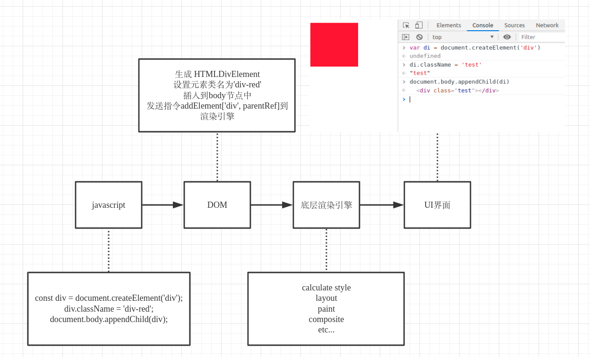

## DOM规范，浏览器和跨平台DOM的存在 ##

DOM全称[文档对象模型](https://developer.mozilla.org/zh-CN/docs/Web/API/Document_Object_Model)

通用的js是不带`DOM`api的，只有在浏览器环境下，才可以直接访问到浏览器提供的`DOM`api，由于浏览器是js的主要执行环境，在大多数人潜意识中认为js自带`DOM`api。

那么`DOM`到底是什么，做什么用的。在后端开发中，经常遇到`ORM`（对象关系映射）一般在`DAO`层提供给更高层访问底层数据库的能力，本身就是一个映射关系。在前端开发中，`DOM`也是一种映射关系，它将底层的渲染引擎和上层的js语言桥接起来。从`CDN`或者后端server获取的静态`HTML`经过浏览器解析之后生成`DOM`结构（这些`DOM`结构用C代码实现，对js暴露接口），`DOM`与渲染引擎之间可能并不是同步的操作（比如说生成队列，异步操作更新），但是这并不重要，只要js认为是同步的就可以。

在浏览器或者在大多数原生的webview模块里，`DOM`是与生俱来的，它们自身实现了`DOM`。开发者的js代码只需要直接操作`DOM`就好。而在多数的移动端跨平台环境下，并没有`DOM`实现。这意味着开发者的js代码无法操作`DOM`，如果底层的渲染引擎没有给开发者暴露接口，那么UI界面将永远不会被渲染展示出来。



如果移动平台没有实现`DOM`，那么该怎么办呢？

## 不要频繁操作DOM ##

在回答上面的问题之前，先引出常见的问题，为什么不要频繁操作`DOM`？解决这个问题有助于我们更好地实现并利用`DOM`。

第一，`DOM`结构复杂。
浏览器要生成一个`div`元素，[生成一个DIV元素要实现的规范](https://developer.mozilla.org/zh-CN/docs/Web/API/HTMLDivElement)，需要实现`EventTarget、Node、Element、HTMLElement`以及`HTMLDivElement`
。`DOM`元素属性很多，所以实例化`DOM`是较为耗时的操作。

第二，跟线程有关。
浏览器对js提供了操作`DOM`的api，比如createElement等。而且操作`DOM`也是同步过程，不存在异步回调。有些操作甚至不是一条线程能完成的，为了保证主线程的同步，就需要阻塞主线程，这个时候触发事件主线程就会无响应，造成明显的卡顿。

`DOM`元素有很多[只读属性](https://developer.mozilla.org/zh-CN/docs/Web/API/Element)，比如`Element.clientHeight，Element.scrollWidth`等等，访问这些属性的时候，`DOM`是需要从渲染引擎的布局中获取，这需要大量计算（比如打开控制台查看元素的盒模型时会感觉到明显卡顿），使用不当就会引发`FSL`（强制同步布局）。

既然创建`DOM`实例是耗时的，在使用的时候应该尽可能地复用。防止频繁地创建销毁`DOM`带来的高GC。通常在上层，js会使用类似Vue和React实现`DOM`的复用，小型项目则可以抛开框架使用对象池达到复用。

从渲染引擎中获取元素布局也是耗时的，如果开发中涉及到元素布局，就应该避免在一次事件中多次触发重新布局。减少对主线程的阻塞。

## 移动端跨平台DOM的实现 ##

可以用C或者java代码实现一套`DOM`api供js调用，不过随着标准的更新，使用其他语言实现DOM就增加了调试成本。而且js本身就灵活，通过js实现一套`DOM`可能更为合适。
想一下`EventTarget、Node、Element、HTMLElement、HTMLDivElement`哪些类是必不可少的？`EventTarget`类负责事件添加、删除、触发，不可或缺。`Node`类提供节点之间的父子关系，不可或缺。其他的类是每一个节点类型的具体实现，似乎优先级可以放后。那么就着手实现`Node`和`EventTarget`。

首先实现`EventTarget`类，这是最基础的类，共有三个方法`addEventListener`，`removeEventListener`，`dispatchEvent`。

```javascript
class SEventTarget {
  constructor() {
    
  }
  addEventListener() {

  }
  removeEventListener() {

  }
  dispatchEvent() {

  }
}
```

先占位，`SEventTarget`的实现要考虑一些复杂情况。

其次实现`Node`（继承`EventTarget`）最常用的三个方法`appendChild`，`insertBefore`，`removeChild`。

```javascript
class SNode extends SEventTarget {
  constructor(type) {
    super()
    this.type = type
    this.children = []
    this.parent = null
  }
  appendChild(node) {
    const index = this.children.indexOf(node)
    if (index !== -1) return
    node.parent = this
    this.children.push(node)
  }

  removeChild(node) {
    const index = this.children.indexOf(node)
    if (index === -1) return
    this.children.splice(index, 1)
    node.parent = null
  }

  insertBefore(base, node) {
    const index = this.children.indexOf(base)
    this.children.splice(index, 0, node)
    node.parent = this
  }
}
```

OK，没有什么问题，有了这个方法就可以构建节点之间的父子关系了。

之后还需要一个根节点类`SDom`，类比`document`，它是`Node`类的子类。

```javascript
class SDom extends SNode {
  constructor (...args) {
    super(...args)
    this.type = 'dom'
  }
  createElement (type) {
    const node = new SNode(type)
    node._root = this
    return node
  }
}
```

还需要一个`SEvent`类，用于实例化Event。

```javascript
class SEvent {
  constructor (type, options) {
    this.type = type
    this.initEvent(options)
  }
  initEvent (options) {
    this.bubbles = options.bubbles || false
    this.cancelable = options.cancelable || false
  }
}
```

OK一起正常，那么就可以这么来使用了。

```javascript
const dom = new SDom()
const div1 = dom.createElement('div')
div1.id = 'div1'
const div2 = dom.createElement('div')
div2.id = 'div2'
const div3 = dom.createElement('div')
div3.id = 'div3'

dom.appendChild(div1)
dom.appendChild(div3)
dom.insertBefore(div1, div2)

const div10 = dom.createElement('div')
div10.id = 'div10'
const div11 = dom.createElement('div')
div11.id = 'div11'
const div12 = dom.createElement('div')
div12.id = 'div12'

div1.appendChild(div10)
div1.appendChild(div11)
div1.appendChild(div12)

div11.addEventListener('click', aa)
div11.addEventListener('click', aa, true)

div11.addEventListener('click', dd)
div11.addEventListener('click', dd, true)

div1.addEventListener('click', bb)
div1.addEventListener('click', bb, true)

dom.addEventListener('click', cc)
dom.addEventListener('click', cc, true)

const event = new SEvent('click', {
  bubbles: true,
  cancelable: true
})

div11.dispatchEvent(event, false)
```

好，回到上面的SEvent类的实现，这里借鉴了Chrome的事件触发机制。要知道，虽然规范是不可以随意修改的，但是一些规范没有覆盖的地方各个厂家的实现就很模糊，而`DOM`事件触发就是这个暗区。由于Chrome的广受欢迎，就按照Chrome的来。
众所周知，事件触发分为三个阶段：`捕获`、`目标对象`、`冒泡`。在`W3C`中，事件的触发并不是针对单个节点，而是针对于整个节点链。是的，节点链。在捕获阶段，事件从根节点（根节点一般是`document/window`）一直触发至目标对象的父节点，执行各个节点的冒泡阶段的回调。在目标对象阶段，事件不会区分捕获还是冒泡，只跟事件的添加顺序有关，依次执行。在冒泡阶段，事件从目标对象的父节点一直触发到根节点。
好，完善代码。

```javascript
// 用于判断option相等
function Equals (obj1, obj2) {
  return obj1.capture === obj2.capture && obj1.once === obj2.once && obj1.passive === obj2.passive
}

function fireEvent (node, event, userAgent) {
  const fnMap = node._eventTargetListeners[event.type]
  const captureList = (fnMap && fnMap.capture && fnMap.capture.fn) || []
  const captureHash = (fnMap && fnMap.capture && fnMap.capture.hash) || []

  const bubbleList = (fnMap && fnMap.bubble && fnMap.bubble.fn) || []
  const bubbleHash = (fnMap && fnMap.bubble && fnMap.bubble.hash) || []

  let indexCapture = 0
  let indexBubble = 0
  const result = {
    fn: [],
    hash: []
  }
  while (indexCapture < captureList.length && indexBubble < bubbleList.length) {
    if (captureHash[indexCapture]._order >= bubbleHash[indexBubble]._order) {
      result.fn.push(bubbleList[indexBubble])
      result.hash.push(bubbleHash[indexBubble])
      indexBubble++
    } else {
      result.fn.push(captureList[indexCapture])
      result.hash.push(captureHash[indexCapture])
      indexCapture++
    }
  }

  while (indexBubble < bubbleList.length) {
    result.fn.push(bubbleList[indexBubble])
    result.hash.push(bubbleHash[indexBubble])
    indexBubble++
  }

  while (indexCapture < captureList.length) {
    result.fn.push(captureList[indexCapture])
    result.hash.push(captureHash[indexCapture])
    indexCapture++
  }

  for (let i = 0, length = result.fn.length; i < length; i++) {
    result.fn[i].call(node, event)
  }

  // once就不判断了
}

export default class SEventTarget {
  constructor () {
    this._eventTargetListeners = {}
    this.order = 0
  }

  addEventListener (evtName, fnListener, options) {
    // 转换为对象
    if (!(options instanceof Object)) {
      options = {
        capture: !!options,
        once: false,
        passive: false,
        _order: this.order++
      }
    } else {
      options = {
        capture: !!options.capture,
        once: !!options.once,
        passive: !!options.passive,
        _order: this.order++
      }
    }

    // 根据PHASE分别保存为对象
    const phase = options.capture ? 'capture' : 'bubble'
    const eventConf = (this._eventTargetListeners[evtName] =
      this._eventTargetListeners[evtName] || {})
    eventConf[phase] = (eventConf[phase] = eventConf[phase] || {
      fn: [],
      hash: []
    })

    const index = eventConf[phase].fn.indexOf(fnListener)
    if (index === -1) {
      // 不存在则添加
      eventConf[phase].fn.push(fnListener)
      eventConf[phase].hash.push(options)
    } else {
      if (!Equals(options, eventConf[phase].hash[index])) {
        eventConf[phase].fn.push(fnListener)
        eventConf[phase].hash.push(options)
      }
    }
    // 发送给底层
  }

  removeEventListener (evtName, fnListener, options) {
    // 转换为对象
    if (!(options instanceof Object)) {
      options = {
        capture: !!options,
        once: false,
        passive: false
      }
    } else {
      options = {
        capture: !!options.capture,
        once: !!options.once,
        passive: !!options.passive
      }
    }

    // 根据PHASE分别保存为对象
    const phase = options.capture ? 'capture' : 'bubble'
    const eventConf = (this._eventTargetListeners[evtName] =
      this._eventTargetListeners[evtName] || {})
    eventConf[phase] = (eventConf[phase] = eventConf[phase] || {
      fn: [],
      hash: []
    })

    const index = eventConf[phase].fn.indexOf(fnListener)
    if (index === -1) {
      // do sth
    } else {
      if (Equals(options, eventConf[phase].hash[index])) {
        eventConf[phase].fn.splice(index, 1)
        eventConf[phase].hash.splice(index, 1)
      }
    }
    // 清除
    if (eventConf[phase].fn.length === 0) {
      eventConf[phase] = null
    }
  }

  dispatchEvent (evt, userAgent = false) {
    evt.target = this

    let currentNode = this

    const parentList = []

    while (currentNode && currentNode.parent) {
      parentList.push(currentNode.parent)
      currentNode = currentNode.parent
    }

    let nodeList = parentList.slice().reverse()

    const thisIndex = nodeList.length

    nodeList.push(this)
    nodeList = nodeList.concat(parentList)

    let index = 0

    while (nodeList.length) {
      let currentPhase
      currentNode = nodeList.shift()
      evt.currentTarget = currentNode
      if (index < thisIndex) {
        currentPhase = evt.phase = 'capture'
      } else if (index > thisIndex) {
        currentPhase = evt.phase = 'bubble'
        if (!evt.bubbles) break
      } else {
        currentPhase = evt.phase = 'target'
        fireEvent(this, evt, userAgent)
        index++
        continue
      }
      const fnMap = currentNode._eventTargetListeners[evt.type]
      const fns = fnMap[currentPhase].fn || []
      for (let i = 0, length = fns.length; i < length; i++) {
        fns[i].call(currentNode, evt)
      }

      index++
    }
    if (userAgent) {
      evt.currentTarget = await null
    } else {
      evt.currentTarget = null
    }
  }
}
```

到此，基本的`DOM`已经实现。

## 原生事件和模拟事件的区别 ##

那么会不会有什么性能问题呢？
来看一篇[经典文章](https://jakearchibald.com/2015/tasks-microtasks-queues-and-schedules/)需要科学上网。

文章里提到通过点击触发的事件和使用代码同步触发的事件的执行顺序并不相同。
为什么呢？其实这个问题也是很好理解的。上面我们提到过，主线程阻塞会造成事件无法响应导致卡顿。

所以在浏览器触发原生事件（通过鼠标或者键盘等触发）的时候，会使用一个`microtask`包裹。这要做是为了在事件队列里进行逻辑处理，不阻塞主线程，使事件能够更好地响应。

所以这里需要在事件触发的时候套上一个`microtask`，代码如下[包装一个microtask](https://github.com/LeeeeeeM/things-about-dom/blob/master/src/pages/SimulateEvent/EventTarget.js)

[demo示例](https://leeeeeem.github.io/things-about-dom/dist/#/)

## 浏览器优化以及框架优化 ##

浏览器为了让事件及时响应做了很多优化手段。上面使用`microtask`就是优化手段之一。再次，Chrome等高级浏览器可以开启`worker`线程，防止主线程进行过多的计算造成阻塞。[启用WebWorker Demo](https://github.com/udacity/web-workers-demo)，通过回调进行数据传输是js的常用优化手段。
当然，减少布局和绘制的次数同样会提高帧率。后来React16版本也通过时间分片和`fiber`结构减少了每一帧的js执行时间，留给浏览器足够的`idle`时间保证帧率。

## 小结 ##

通过自己实现`DOM`渐进式地引出`DOM`事件模型和优化手段。
前端还有很多需要针对具体问题进行优化的点，欢迎探讨。
相关代码库如下[github](https://github.com/LeeeeeeM/things-about-dom)。
